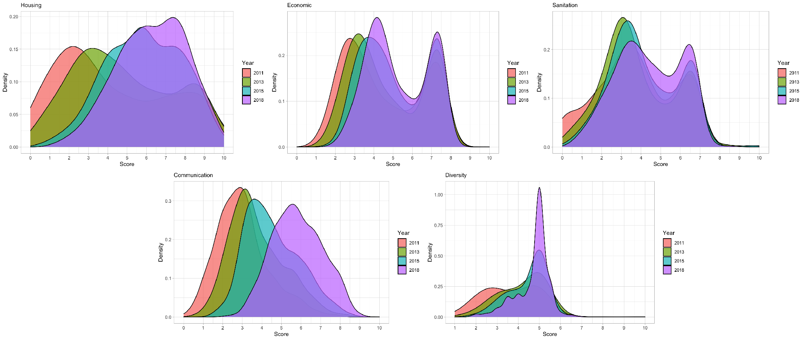
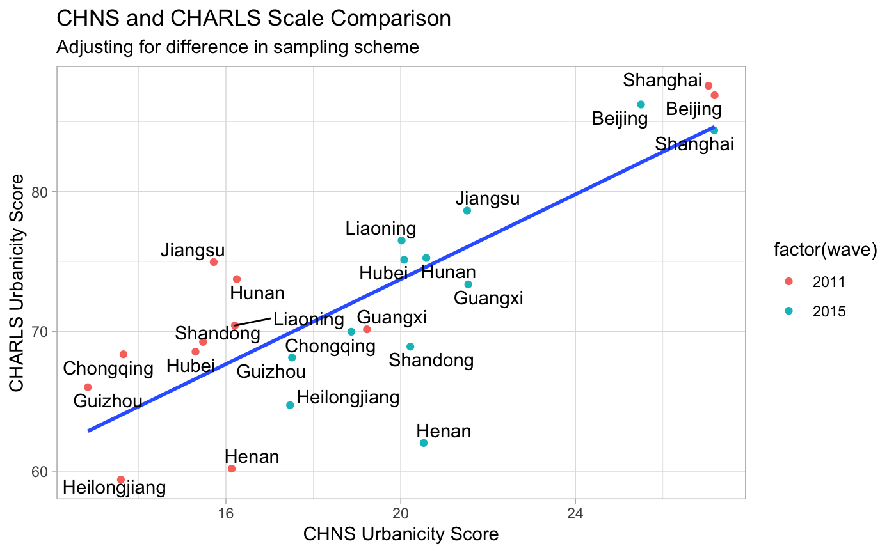

# CHARLS Urbanicity Scale

## Introduction
This is the code repository for the paper, *Quantifying the latent urban dimension: Development of an Urbanicity Scale for the China Health and Retirement Longitudinal Study*. This repository contains the R codes used for the construction and validation of the scale. It also contains (will contain) a detaild documentation of the scale construction scheme.

## Authors
* [**Shozen Dan**](https://www.linkedin.com/in/shozendan/), Stanford CARE SRI 2020, University of California Davis (Statistics), Keio University (Environmental and Informational Studies)
* [**Nicholas Ortega**](https://www.linkedin.com/in/nicholasmo/), Stanford CARE SRI 2020, University of California Los Angelese (Statistics)

## Contents
The repository is stuctured as follows:

<ul>
  <li><b>Construction</b>: Contains the R codes used for constructing the scale.
  </li>
  <li><b>Scores</b>: Contains the generated scores
  </li>
  <li><b>Validation</b>: Contains the R codes for internal and external validation.
  </li>
</ul>

All three directories are a set of directories named **Individual** and **Community**. They indicate whether the directory contains code/scores for aggregated individual data or 2011 community data.

## Overview

## Internal Validation

### Reciever Operator Characteristics

## External Validation
### China Health and Nutrition Survey

*Last Update: Nov. 5th, 2020 by Shozen Dan*