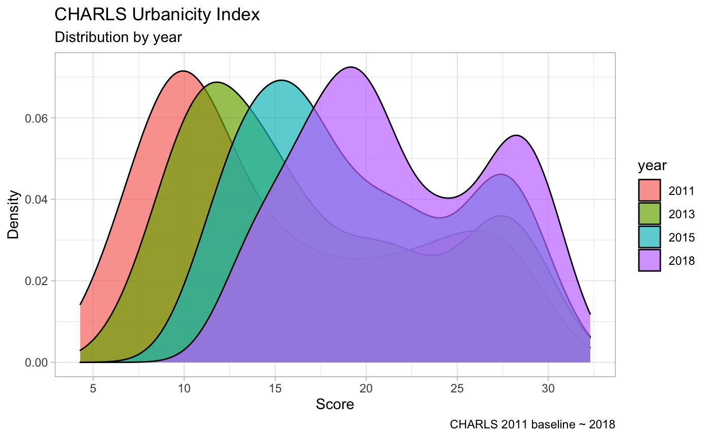
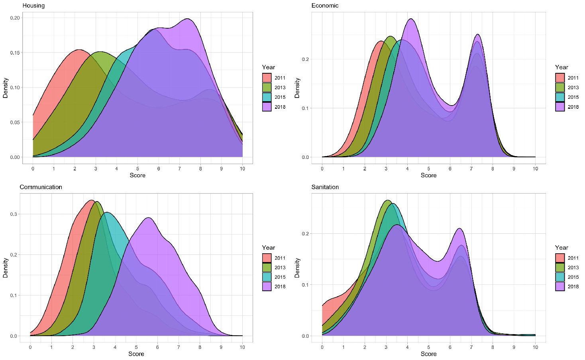
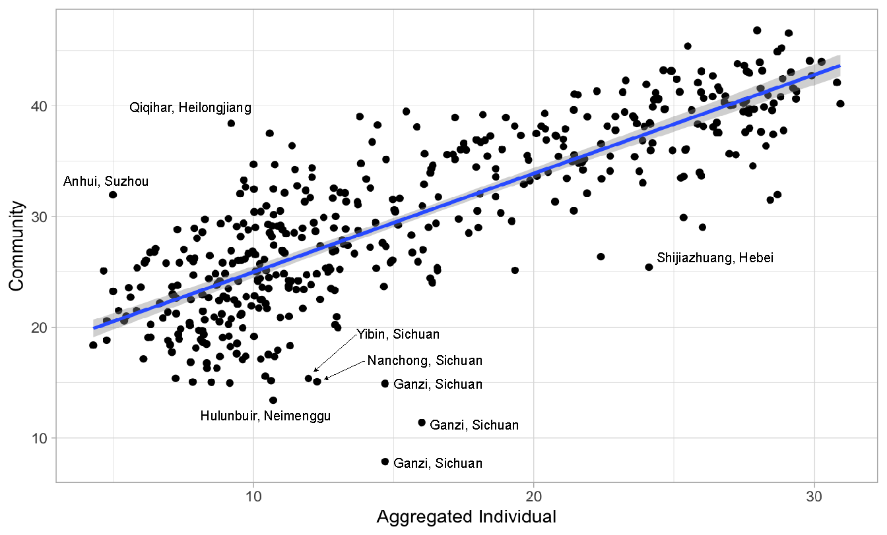
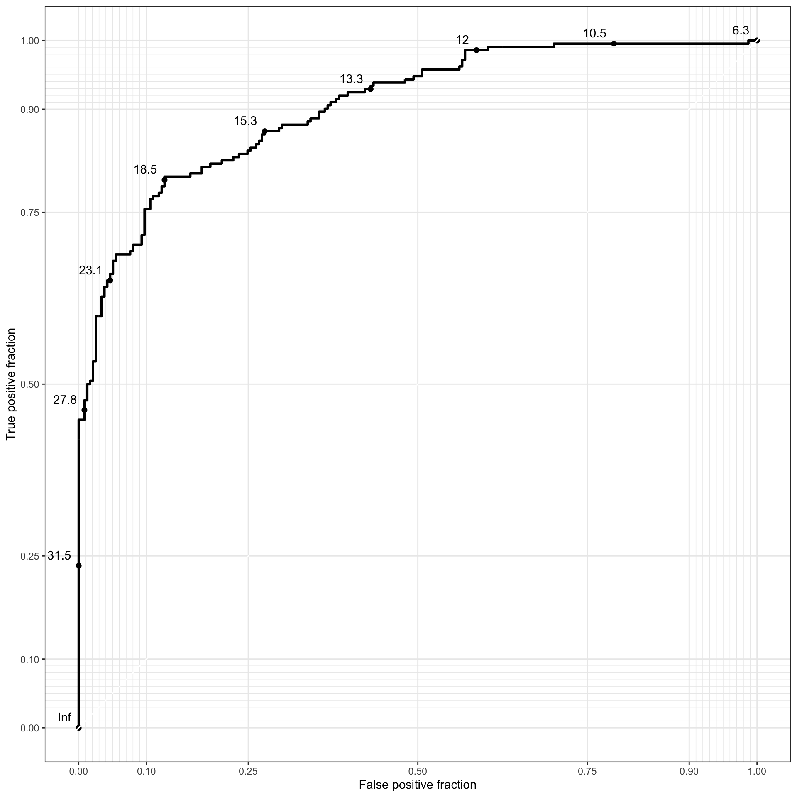
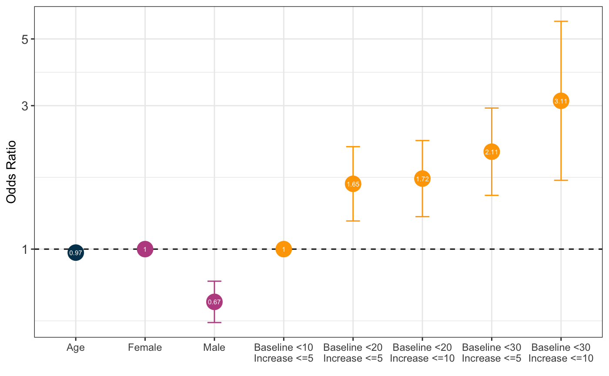
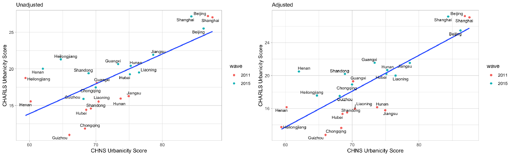

# CHARLS Urbanicity Scale

## Introduction
This is the code repository for the paper, *Quantifying the latent urban dimension: Development of an Urbanicity Scale for the China Health and Retirement Longitudinal Study*. This repository contains the R codes used for the construction and validation of the scale. It also contains (will contain) a detailed documentation of the scale construction scheme.

## Authors
* [**Shozen Dan**](https://www.linkedin.com/in/shozendan/), Stanford CARE SRI 2020, University of California Davis (Statistics), Keio University (Environmental and Informational Studies)
* [**Nicholas Ortega**](https://www.linkedin.com/in/nicholasmo/), Stanford CARE SRI 2020, University of California Los Angelese (Statistics)

## Acknowledgements
This project's CHARLS data was analyzed as part of the research project on chronic disease management in China led by Karen Eggleston of Stanford's Asia Health Policy Program.

## Contents
The repository is stuctured as follows:

<ul>
  <li><b>Construction</b>: Contains the R codes used for constructing the scale.
  </li>
  <li><b>Scores</b>: Contains the generated score files
  </li>
  <li><b>Validation</b>: Contains the R codes for internal and external validation.
  </li>
</ul>

All three directories are a set of directories named **Individual** and **Community**. They indicate whether the directory contains code/scores for aggregated individual data or 2011 community data.

## Overview

  </img>
  

## Internal Validation

  </img>

The figure above displays the relationship between our scale (aggregated individual scores) and the scale constructed from the community data file for 2011. Overall, the two scales demonstrate a strong linear relationship with Pearson’s correlation coefficient at 0.82 (95% CI: 0.79, 0.85). However, there were several outliers for communities within Sichuan, Neimengu, Suzhou, Heilongjiang, and Hebei provinces.

### Reciever Operator Characteristics

  </img>

Using receiver operator characteristic curve determination of maximum specificity and sensitivity, we dichotomized communities into urban and rural categories using a cutoff point of 14.7. The kappa statistic for agreement beyond chance against the "Gold Standard" was 0.66 which can be interpreted as very good, indicating that our scale has good criterion validity. 

### Construct Validity
The construct validity a scale is the extent to which it accomplishes the purpose claimed for it.

### Use Cases
 We provide a example of how it may be utilized, by examining the effect of baseline urbanicity and urbanicity change on the likelihood of becoming over weight (BMI >= 25).

  </img>

## External Validation
### China Health and Nutrition Survey
As a way of assessing the validity of our scale using external sources, we compared our scale to the CHNS urbanicity scale. There is an overlap between the two studies in 12 provinces for the years 2011 and 2015. In order to account for the difference in sampling strategy, we adopted a Monte Carlo method to simulate the sampling strategy of CHNS.

  

## Contact
* **Shozen Dan**: shozendn@stanford.edu

*Last Update: Nov. 19th, 2020 by Shozen Dan*